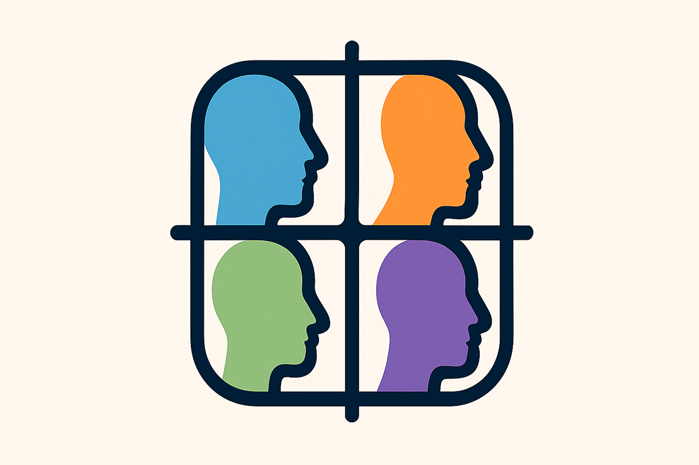

  <h1 align="center">SimuLab: Collaborative AI Agents</h1>
  

    
    
     
  
  

    

    
  

## About SimuLab

SimuLab uses GPT-4.1 to create multiple agents who collaborate to achieve predefined goals. The main objective of this project is to explore the potential of GPT models in enhancing multi-agent productivity and effective communication.

See a video demo here: https://www.youtube.com/watch?v=cIxhI1d6NsM

Read more about the architecture here: https://blog.langchain.dev/gpteam-a-multi-agent-simulation/

## Getting started

To begin exploring SimuLab, follow these steps:

1. Clone the project repository to your local machine
2. Move to the repository: `cd simulab`
3. Run `python setup.py` to check your environment setup and configure it as needed
4. Update the environment variables in `.env` with your API Keys. You will need an OpenAI API key, which you can obtain [here](https://platform.openai.com/account/api-keys). Supplying API keys for optional services will enable the use of other tools.
5. Launch the world by running `poetry run world`

Now you can observe the world in action and watch as the agents interact with each other, working together to accomplish their assigned directives.

## How it works

SimuLab employs separate agents, each equipped with a memory, that interact with one another using communication as a tool. The implementation of agent memory and reflection is inspired by [this research paper](https://arxiv.org/pdf/2304.03442.pdf). The general infrastructure is inspired by the original code from GPTTeam [this code base](https://github.com/101dotxyz/GPTeam/blob/main/.env.example). Agents move around the world and perform tasks in different locations, depending on what they are doing and where other agents are located. They can speak to eachother and collaborate on tasks, working in parallel towards common goals.

## Viewing Agents

The world is a busy place! To get a view of what different agents are doing whilst the world is running, you can visit the `agents/` folder where there is a txt file for each agent containing a summary of their current state.

## Contributing

We enthusiastically welcome contributions to SimuLab! To contribute, please follow these steps:

1. Fork the project repository to your own account
2. Create a new branch for your changes
3. Implement your changes to the project code
4. Submit a pull request to the main project repository

We will review your pull request and provide feedback as necessary.

## License

Licensed under the [MIT license](LICENSE).
